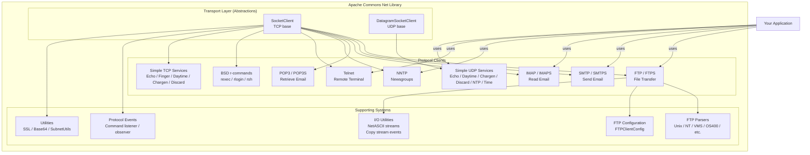

# Conceptual Diagram — Apache Commons Net 3.5

Paste the block below into any Mermaid renderer (e.g. mermaid.live).

---

## Reading This Diagram

- **Transport Layer** — Two abstract bases handle socket lifecycle (open, close, timeout, factory injection).
- **Protocol Clients** — Each protocol is a separate module extending the appropriate transport base. SSL variants (`FTPS`, `SMTPS`, `IMAPS`, `POP3S`) extend their plain counterpart.
- **Supporting Systems** — Shared infrastructure: I/O stream decorators, pluggable FTP directory-listing parsers, a configuration object, an observer/event system for logging commands, and SSL/utility helpers.
- **Your Application** — Consumers import and call the protocol clients directly.
