# Concrete Diagram — Apache Commons Net 3.5

Paste the block below into any Mermaid renderer (e.g. mermaid.live).

```mermaid
classDiagram
    direction TB

    namespace Transport {
        class SocketClient {
            <<abstract>>
            #int _timeout_
            #Socket _socket_
            #SocketFactory _socketFactory_
            #ProtocolCommandSupport _commandSupport_
            +connect(host, port)
            +disconnect()
            +setSocketFactory()
            #_connectAction_()
        }

        class DatagramSocketClient {
            <<abstract>>
            #DatagramSocket _socket_
            #DatagramSocketFactory _socketFactory_
            +open()
            +close()
        }
    }

    namespace FTP_Stack {
        class FTP {
            #BufferedReader _controlInput_
            #BufferedWriter _controlOutput_
            +sendCommand(command, args)
            +getReplyCode()
            +getReplyString()
        }

        class FTPClient {
            -FTPFileEntryParserFactory parserFactory
            -CopyStreamListener copyStreamListener
            +login(user, pass)
            +storeFile(remote, input)
            +retrieveFile(remote, output)
            +listFiles()
            +configure(FTPClientConfig)
        }

        class FTPSClient {
            -SSLContext context
            -TrustManager trustManager
            -KeyManager keyManager
            +execAUTH()
            +execPBSZ()
            +execPROT()
        }

        class FTPHTTPClient {
            -String proxyHost
            -int proxyPort
        }
    }

    namespace FTP_Parsers {
        class FTPFileEntryParser {
            <<interface>>
            +parseFTPEntry(line) FTPFile
            +preParse(entries) List
        }

        class FTPFileEntryParserFactory {
            <<interface>>
            +createFileEntryParser(key) FTPFileEntryParser
        }

        class DefaultFTPFileEntryParserFactory {
            +createFileEntryParser(key) FTPFileEntryParser
        }

        class CompositeFileEntryParser {
            -FTPFileEntryParser[] parsers
            -FTPFileEntryParser cached
            +parseFTPEntry(line) FTPFile
        }

        class UnixFTPEntryParser
        class NTFTPEntryParser
        class VMSFTPEntryParser
        class OS400FTPEntryParser
        class NetwareFTPEntryParser
        class MVSFTPEntryParser
        class MacOsPeterFTPEntryParser
    }

    namespace SMTP_Stack {
        class SMTP {
            +sendCommand(command)
            +getReplyCode()
        }

        class SMTPClient {
            +login()
            +setSender()
            +addRecipient()
            +sendShortMessageData() Writer
        }

        class SMTPSClient {
            -SSLContext context
            +execTLS()
        }
    }

    namespace IMAP_Stack {
        class IMAP {
            +sendCommand(command)
            +getReplyStrings()
        }

        class IMAPClient {
            +select(mailbox)
            +fetch(sequenceSet, itemNames)
        }

        class IMAPSClient {
            +execTLS()
        }
    }

    namespace NNTP_Stack {
        class NNTP {
            +sendCommand(command)
        }

        class NNTPClient {
            +selectNewsgroup(newsgroup)
            +retrieveArticle(articleNumber)
            +postArticle(writer)
            +listNewsgroups()
        }
    }

    namespace Telnet_Stack {
        class Telnet {
            #TelnetOptionHandler[] optionHandlers
        }

        class TelnetClient {
            +getInputStream() InputStream
            +getOutputStream() OutputStream
            +addOptionHandler(TelnetOptionHandler)
        }
    }

    namespace BSD_Commands {
        class RExecClient {
            +rexec(host, port, user, pass, cmd, stderr)
        }

        class RLoginClient
        class RCommandClient
    }

    namespace UDP_Clients {
        class NTPUDPClient {
            +getTime(host) TimeInfo
        }

        class EchoUDPClient
        class DaytimeUDPClient
        class CharGenUDPClient
        class DiscardUDPClient
    }

    namespace Observer_Events {
        class ProtocolCommandListener {
            <<interface>>
            +protocolCommandSent(event)
            +protocolReplyReceived(event)
        }

        class ProtocolCommandSupport {
            -ListenerList listeners
            +addProtocolCommandListener(l)
            +fireCommandSent(command, message)
            +fireReplyReceived(replyCode, message)
        }

        class PrintCommandListener {
            +protocolCommandSent(event)
            +protocolReplyReceived(event)
        }
    }

    namespace IO_Utilities {
        class CopyStreamListener {
            <<interface>>
            +bytesTransferred(event)
        }

        class CopyStreamAdapter {
            +bytesTransferred(event)
        }
    }

    %% Inheritance
    SocketClient <|-- FTP
    FTP <|-- FTPClient
    FTPClient <|-- FTPSClient
    FTPClient <|-- FTPHTTPClient

    SocketClient <|-- SMTP
    SMTP <|-- SMTPClient
    SMTPClient <|-- SMTPSClient

    SocketClient <|-- IMAP
    IMAP <|-- IMAPClient
    IMAPClient <|-- IMAPSClient

    SocketClient <|-- NNTP
    NNTP <|-- NNTPClient

    SocketClient <|-- Telnet
    Telnet <|-- TelnetClient

    SocketClient <|-- RExecClient
    RExecClient <|-- RLoginClient
    RExecClient <|-- RCommandClient

    DatagramSocketClient <|-- NTPUDPClient
    DatagramSocketClient <|-- EchoUDPClient
    DatagramSocketClient <|-- DaytimeUDPClient
    DatagramSocketClient <|-- CharGenUDPClient
    DatagramSocketClient <|-- DiscardUDPClient

    %% FTP Parser relationships
    FTPFileEntryParserFactory <|.. DefaultFTPFileEntryParserFactory
    FTPFileEntryParser <|.. CompositeFileEntryParser
    FTPFileEntryParser <|.. UnixFTPEntryParser
    FTPFileEntryParser <|.. NTFTPEntryParser
    FTPFileEntryParser <|.. VMSFTPEntryParser
    FTPFileEntryParser <|.. OS400FTPEntryParser
    FTPFileEntryParser <|.. NetwareFTPEntryParser
    FTPFileEntryParser <|.. MVSFTPEntryParser
    FTPFileEntryParser <|.. MacOsPeterFTPEntryParser
    FTPClient --> FTPFileEntryParserFactory : uses
    DefaultFTPFileEntryParserFactory --> FTPFileEntryParser : creates

    %% Observer relationships
    SocketClient --> ProtocolCommandSupport : owns
    ProtocolCommandSupport --> ProtocolCommandListener : notifies
    ProtocolCommandListener <|.. PrintCommandListener

    %% IO relationships
    CopyStreamListener <|.. CopyStreamAdapter
    FTPClient --> CopyStreamListener : uses
```

---

## Reading This Diagram

- Each **namespace box** corresponds to a logical group (package or subsystem).
- Every protocol stack follows the same two-level inheritance from `SocketClient`: low-level command layer → high-level client → SSL variant.
- **FTP Parsers** are injected via the factory — `FTPClient` never hardcodes an OS format.
- **Observer Events** are inherited by every protocol automatically through `SocketClient`.
