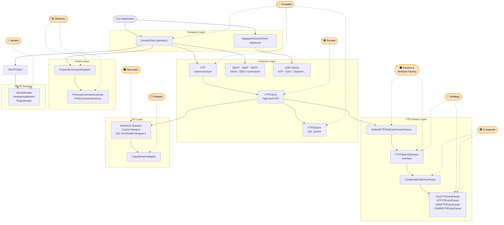

# Pattern Flow Diagram — Apache Commons Net 3.5

Paste the block below into any Mermaid renderer (e.g. mermaid.live).

---

## Reading This Diagram

- **Boxes with solid borders** are the system's components grouped by layer (top to bottom = the flow of a request through the library).
- **Orange dashed circles** are pattern annotations. The dashed arrows show which components each pattern governs.
- **Overlaps** are visible where multiple pattern circles point to the same component:
  - `FTPFileEntryParser interface` ← Factory/Abstract Factory **and** Strategy
  - Concrete parsers (`Unix`, `NT`, `VMS`...) ← Strategy **and** Composite
  - `CompositeFileEntryParser` ← Composite **and** (implicitly) Strategy
