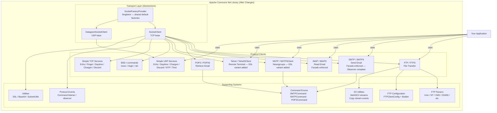

# Conceptual Diagram — Apache Commons Net 3.5 (After Changes)

```mermaid
graph TD
    subgraph Library["Apache Commons Net Library (After Changes)"]
        direction TB

        subgraph Transport["Transport Layer (Abstractions)"]
            SFP[SocketFactoryProvider\nSingleton — shared default factories]
            SC[SocketClient\nTCP base]
            DSC[DatagramSocketClient\nUDP base]
        end

        subgraph Protocols["Protocol Clients"]
            FTP[FTP / FTPS\nFile Transfer]
            SMTP[SMTP / SMTPS\nSend Email\nFacade enforced — Observer complete]
            IMAP[IMAP / IMAPS\nRead Email\nFacade enforced]
            POP3[POP3 / POP3S\nRetrieve Email]
            NNTP[NNTP / NNTPSClient\nNewsgroups — SSL variant added]
            TELNET[Telnet / TelnetSClient\nRemote Terminal — SSL variant added]
            BSD[BSD r-commands\nrexec / rlogin / rsh]
            SIMPLE_TCP[Simple TCP Services\nEcho / Finger / Daytime / Chargen / Discard]
            SIMPLE_UDP[Simple UDP Services\nEcho / Daytime / Chargen / Discard / NTP / Time]
        end

        subgraph Support["Supporting Systems"]
            IO[I/O Utilities\nNetASCII streams\nCopy stream events]
            FTPPARSER[FTP Parsers\nUnix / NT / VMS / OS400 / etc.]
            FTPCONFIG[FTP Configuration\nFTPClientConfig + Builder]
            EVENTS[Protocol Events\nCommand listener / observer]
            UTIL[Utilities\nSSL / Base64 / SubnetUtils]
            CMDENUMS[Command Enums\nSMTPCommand · NNTPCommand · POP3Command]
        end
    end

    SFP --> SC
    SFP --> DSC

    SC --> FTP
    SC --> SMTP
    SC --> IMAP
    SC --> POP3
    SC --> NNTP
    SC --> TELNET
    SC --> BSD
    SC --> SIMPLE_TCP

    DSC --> SIMPLE_UDP

    FTP --> FTPPARSER
    FTP --> FTPCONFIG
    FTP --> IO

    SC --> EVENTS
    SC --> UTIL

    SMTP --> CMDENUMS
    NNTP --> CMDENUMS
    POP3 --> CMDENUMS

    APP[Your Application] -->|uses| FTP
    APP -->|uses| SMTP
    APP -->|uses| IMAP
    APP -->|uses| NNTP
    APP -->|uses| TELNET
    APP -->|uses| SIMPLE_UDP
```

