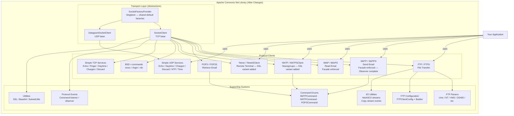

# Conceptual Diagram — Apache Commons Net 3.5 (After Changes)

Paste the block below into any Mermaid renderer (e.g. mermaid.live).

---

## Reading This Diagram

- **Transport Layer** — Two abstract bases handle socket lifecycle. A new `SocketFactoryProvider` Singleton now centralizes the default `SocketFactory`, `ServerSocketFactory`, and `DatagramSocketFactory` instances that were previously scattered as static fields on `SocketClient` and `DatagramSocketClient` separately.
- **Protocol Clients** — Each protocol extends the appropriate transport base. SSL variants (`FTPS`, `SMTPS`, `IMAPS`, `POP3S`) were already present. Two new SSL variants complete the set: `NNTPSClient` and `TelnetSClient`, both implemented via the Template Method pattern.
- **Facade Enforcement** — `SMTPClient`, `IMAPClient`, and `NNTPClient` now match the two-tier contract already established by `FTPClient`: the base class owns all raw protocol I/O; the client class is a pure high-level Facade. New accessor methods (`getDataWriter`, `openMessageReader`, `appendWithData`) were added to the base classes to complete this boundary.
- **Observer Events** — The `SMTP` base class now fires both `commandSent` and `replyReceived` events, completing consistent Observer coverage across all line-oriented protocols. `IMAP`, `NNTP`, and `FTP` were already fully wired. `Telnet` remains excluded by design (binary stream, no line-oriented command structure).
- **Command Enums** — `SMTPCommand`, `NNTPCommand`, and `POP3Command` were converted from classes of `static final int` constants to proper Java enums. All three protocol base classes received type-safe `sendCommand(enum, args)` overloads; the old `int`-based overloads are deprecated but retained for compatibility.
- **FTP Configuration** — `FTPClientConfig` now ships with an inner fluent `Builder`, allowing configuration objects to be constructed step-by-step without positional constructor arguments.
- **Your Application** — Consumers interact with the same public client classes; all structural changes are transparent to callers.

---

## Description

This conceptual diagram shows the full high-level architecture of Apache Commons Net 3.5 after all five problem changes were applied. The library is organized into three layers: a Transport Layer where a new `SocketFactoryProvider` Singleton now supplies shared default socket factories to both abstract base classes; a Protocol Clients layer where all major protocols are present and two new SSL variants (`NNTPSClient`, `TelnetSClient`) complete the TLS coverage story; and a Supporting Systems layer that now includes type-safe command enums (`SMTPCommand`, `NNTPCommand`, `POP3Command`) and a fluent `FTPClientConfig.Builder`. All changes are additive and backwards compatible — the calling application continues to interact through the same public API.
