# Concrete Diagram — Apache Commons Net 3.5 (After Changes)

Paste the block below into any Mermaid renderer (e.g. mermaid.live).

```mermaid
classDiagram
    direction TB

    namespace Singleton_Provider {
        class SocketFactoryProvider {
            <<singleton>>
            -SocketFactoryProvider INSTANCE
            -SocketFactory defaultSocketFactory
            -ServerSocketFactory defaultServerSocketFactory
            -DatagramSocketFactory defaultDatagramSocketFactory
            -SocketFactoryProvider()
            +getInstance() SocketFactoryProvider
            +getSocketFactory() SocketFactory
            +getServerSocketFactory() ServerSocketFactory
            +getDatagramSocketFactory() DatagramSocketFactory
        }
    }

    namespace Transport {
        class SocketClient {
            <<abstract>>
            #int _timeout_
            #Socket _socket_
            #SocketFactory _socketFactory_
            #ProtocolCommandSupport _commandSupport_
            +connect(host, port)
            +disconnect()
            +setSocketFactory()
            #_connectAction_()
        }

        class DatagramSocketClient {
            <<abstract>>
            #DatagramSocket _socket_
            #DatagramSocketFactory _socketFactory_
            +open()
            +close()
        }
    }

    namespace FTP_Stack {
        class FTP {
            #BufferedReader _controlInput_
            #BufferedWriter _controlOutput_
            +sendCommand(command, args)
            +getReplyCode()
            +getReplyString()
        }

        class FTPClient {
            -FTPFileEntryParserFactory parserFactory
            -CopyStreamListener copyStreamListener
            +login(user, pass)
            +storeFile(remote, input)
            +retrieveFile(remote, output)
            +listFiles()
            +configure(FTPClientConfig)
        }

        class FTPSClient {
            -SSLContext context
            -TrustManager trustManager
            -KeyManager keyManager
            +execAUTH()
            +execPBSZ()
            +execPROT()
        }

        class FTPHTTPClient {
            -String proxyHost
            -int proxyPort
        }
    }

    namespace FTP_Config {
        class FTPClientConfig {
            -String serverSystemKey
            -String defaultDateFormatStr
            -String recentDateFormatStr
            -String serverTimeZoneId
            -String shortMonthNames
            +FTPClientConfig(systemKey)
            +getServerSystemKey() String
            +setDefaultDateFormatStr(str)
            +setServerTimeZoneId(id)
        }

        class FTPClientConfigBuilder {
            -String systemKey
            -String serverTimeZoneId
            -String defaultDateFormatStr
            -String recentDateFormatStr
            -String shortMonthNames
            +FTPClientConfigBuilder(systemKey)
            +serverTimeZoneId(id) FTPClientConfigBuilder
            +defaultDateFormatStr(fmt) FTPClientConfigBuilder
            +recentDateFormatStr(fmt) FTPClientConfigBuilder
            +shortMonthNames(names) FTPClientConfigBuilder
            +build() FTPClientConfig
        }
    }

    namespace FTP_Parsers {
        class FTPFileEntryParser {
            <<interface>>
            +parseFTPEntry(line) FTPFile
            +preParse(entries) List
        }

        class FTPFileEntryParserFactory {
            <<interface>>
            +createFileEntryParser(key) FTPFileEntryParser
        }

        class DefaultFTPFileEntryParserFactory {
            +createFileEntryParser(key) FTPFileEntryParser
        }

        class CompositeFileEntryParser {
            -FTPFileEntryParser[] parsers
            -FTPFileEntryParser cached
            +parseFTPEntry(line) FTPFile
        }

        class UnixFTPEntryParser
        class NTFTPEntryParser
        class VMSFTPEntryParser
        class OS400FTPEntryParser
        class NetwareFTPEntryParser
        class MVSFTPEntryParser
        class MacOsPeterFTPEntryParser
    }

    namespace SMTP_Stack {
        class SMTP {
            +sendCommand(command)
            +sendCommand(SMTPCommand, args)
            +sendCommand(SMTPCommand)
            +getReplyCode()
            #__sendCommand(id, args)
            #__getReply()
            #getDataWriter() Writer
        }

        class SMTPClient {
            +login()
            +setSender()
            +addRecipient()
            +sendShortMessageData() Writer
            +sendMessageData() Writer
        }

        class SMTPSClient {
            -SSLContext context
            +execTLS()
        }
    }

    namespace IMAP_Stack {
        class IMAP {
            +sendCommand(command)
            +getReplyStrings()
            #sendCommandWithID(tag, command, args)
            #__getReply()
            +appendWithData(args, message) boolean
        }

        class IMAPClient {
            +select(mailbox)
            +fetch(sequenceSet, itemNames)
            +append(mailbox, flags, datetime, message)
        }

        class IMAPSClient {
            +execTLS()
        }
    }

    namespace NNTP_Stack {
        class NNTP {
            +sendCommand(command)
            +sendCommand(NNTPCommand, args)
            +sendCommand(NNTPCommand)
            #__getReply()
            #openMessageReader() BufferedReader
            #getDataWriter() Writer
        }

        class NNTPClient {
            +selectNewsgroup(newsgroup)
            +retrieveArticle(articleNumber)
            +postArticle(writer)
            +forwardArticle(messageId)
            +listNewsgroups()
        }

        class NNTPSClient {
            -SSLContext context
            #_connectAction_()
        }
    }

    namespace Telnet_Stack {
        class Telnet {
            #TelnetOptionHandler[] optionHandlers
        }

        class TelnetClient {
            +getInputStream() InputStream
            +getOutputStream() OutputStream
            +addOptionHandler(TelnetOptionHandler)
        }

        class TelnetSClient {
            -SSLContext context
            #_connectAction_()
        }
    }

    namespace BSD_Commands {
        class RExecClient {
            +rexec(host, port, user, pass, cmd, stderr)
        }

        class RLoginClient
        class RCommandClient
    }

    namespace UDP_Clients {
        class NTPUDPClient {
            +getTime(host) TimeInfo
        }

        class EchoUDPClient
        class DaytimeUDPClient
        class CharGenUDPClient
        class DiscardUDPClient
    }

    namespace Observer_Events {
        class ProtocolCommandListener {
            <<interface>>
            +protocolCommandSent(event)
            +protocolReplyReceived(event)
        }

        class ProtocolCommandSupport {
            -ListenerList listeners
            +addProtocolCommandListener(l)
            +fireCommandSent(command, message)
            +fireReplyReceived(replyCode, message)
        }

        class PrintCommandListener {
            +protocolCommandSent(event)
            +protocolReplyReceived(event)
        }
    }

    namespace IO_Utilities {
        class CopyStreamListener {
            <<interface>>
            +bytesTransferred(event)
        }

        class CopyStreamAdapter {
            +bytesTransferred(event)
        }
    }

    namespace Command_Enums {
        class SMTPCommand {
            <<enumeration>>
            HELO
            EHLO
            MAIL
            RCPT
            DATA
            NOOP
            QUIT
            RSET
            VRFY
            +getCommand() String
        }

        class NNTPCommand {
            <<enumeration>>
            ARTICLE
            BODY
            GROUP
            HELP
            IHAVE
            LIST
            POST
            QUIT
            STAT
            +getCommand() String
        }

        class POP3Command {
            <<enumeration>>
            USER
            PASS
            QUIT
            STAT
            LIST
            RETR
            DELE
            NOOP
            RSET
            +getCommand() String
        }
    }

    %% Singleton provides factories to transport bases
    SocketFactoryProvider ..> SocketClient : provides factories
    SocketFactoryProvider ..> DatagramSocketClient : provides factories

    %% Transport inheritance
    SocketClient <|-- FTP
    FTP <|-- FTPClient
    FTPClient <|-- FTPSClient
    FTPClient <|-- FTPHTTPClient

    SocketClient <|-- SMTP
    SMTP <|-- SMTPClient
    SMTPClient <|-- SMTPSClient

    SocketClient <|-- IMAP
    IMAP <|-- IMAPClient
    IMAPClient <|-- IMAPSClient

    SocketClient <|-- NNTP
    NNTP <|-- NNTPClient
    NNTPClient <|-- NNTPSClient

    SocketClient <|-- Telnet
    Telnet <|-- TelnetClient
    TelnetClient <|-- TelnetSClient

    SocketClient <|-- RExecClient
    RExecClient <|-- RLoginClient
    RExecClient <|-- RCommandClient

    DatagramSocketClient <|-- NTPUDPClient
    DatagramSocketClient <|-- EchoUDPClient
    DatagramSocketClient <|-- DaytimeUDPClient
    DatagramSocketClient <|-- CharGenUDPClient
    DatagramSocketClient <|-- DiscardUDPClient

    %% FTP Parser relationships
    FTPFileEntryParserFactory <|.. DefaultFTPFileEntryParserFactory
    FTPFileEntryParser <|.. CompositeFileEntryParser
    FTPFileEntryParser <|.. UnixFTPEntryParser
    FTPFileEntryParser <|.. NTFTPEntryParser
    FTPFileEntryParser <|.. VMSFTPEntryParser
    FTPFileEntryParser <|.. OS400FTPEntryParser
    FTPFileEntryParser <|.. NetwareFTPEntryParser
    FTPFileEntryParser <|.. MVSFTPEntryParser
    FTPFileEntryParser <|.. MacOsPeterFTPEntryParser
    FTPClient --> FTPFileEntryParserFactory : uses
    DefaultFTPFileEntryParserFactory --> FTPFileEntryParser : creates

    %% FTPClientConfig Builder relationship
    FTPClientConfigBuilder --> FTPClientConfig : builds
    FTPClient --> FTPClientConfig : configured by

    %% Command Enum usage
    SMTP --> SMTPCommand : sendCommand uses
    NNTP --> NNTPCommand : sendCommand uses

    %% Observer relationships
    SocketClient --> ProtocolCommandSupport : owns
    ProtocolCommandSupport --> ProtocolCommandListener : notifies
    ProtocolCommandListener <|.. PrintCommandListener

    %% IO relationships
    CopyStreamListener <|.. CopyStreamAdapter
    FTPClient --> CopyStreamListener : uses
```

---

## Reading This Diagram

- Each **namespace box** corresponds to a logical group (package or subsystem).
- **`SocketFactoryProvider`** is new. It is a Singleton that centralizes the default `SocketFactory`, `ServerSocketFactory`, and `DatagramSocketFactory` instances. Both `SocketClient` and `DatagramSocketClient` now obtain their defaults from it instead of holding static fields independently.
- Every protocol stack follows the same two-level inheritance from `SocketClient`: low-level command layer → high-level client → SSL variant. **`NNTPSClient`** and **`TelnetSClient`** are new SSL variants that complete this pattern for NNTP and Telnet.
- **`SMTP`** has three new members: `sendCommand(SMTPCommand, args)`, `sendCommand(SMTPCommand)` (type-safe overloads), and `protected getDataWriter()` (Facade accessor so `SMTPClient` never touches `_writer` directly). `__getReply()` now calls `fireReplyReceived()`, completing Observer coverage.
- **`IMAP`** has a new `appendWithData(args, message)` method. The two-step APPEND continuation-and-literal wire exchange previously scattered across `IMAPClient` now lives entirely in the base class.
- **`NNTP`** has three new members: `sendCommand(NNTPCommand, args)`, `sendCommand(NNTPCommand)` (type-safe overloads), `openMessageReader()`, and `getDataWriter()`. Client methods now call these accessors instead of constructing dot-terminated stream wrappers directly.
- **`FTPClientConfigBuilder`** represents the `FTPClientConfig.Builder` inner class. It collects optional configuration fields through fluent setters and produces a fully configured `FTPClientConfig` via `build()`.
- **`Command_Enums`** namespace contains `SMTPCommand`, `NNTPCommand`, and `POP3Command` — all converted from classes of `static final int` constants to proper Java enums. The `getCommand()` method returns the wire-format string for each constant.
- **FTP Parsers** are injected via factory — `FTPClient` never hardcodes an OS format.
- **Observer Events** are inherited by every protocol through `SocketClient`. After the changes, all line-oriented protocols (FTP, SMTP, IMAP, NNTP) fire both `commandSent` and `replyReceived` consistently.

---

## Description

The concrete diagram shows every class, interface, and enum in Apache Commons Net 3.5 after all changes, organized into namespace boxes by subsystem. The key additions are: `SocketFactoryProvider` (Singleton, Transport layer), `NNTPSClient` and `TelnetSClient` (Template Method SSL variants completing the protocol set), `FTPClientConfigBuilder` (Builder for `FTPClientConfig`), `SMTPCommand` / `NNTPCommand` / `POP3Command` (enum upgrades in the Command Enums namespace), and new Facade-enforcing methods on the `SMTP`, `IMAP`, and `NNTP` base classes (`getDataWriter`, `appendWithData`, `openMessageReader`). Every protocol stack retains its two-level inheritance structure from `SocketClient`, and all Observer infrastructure flows through the single `ProtocolCommandSupport` instance owned by `SocketClient`.
