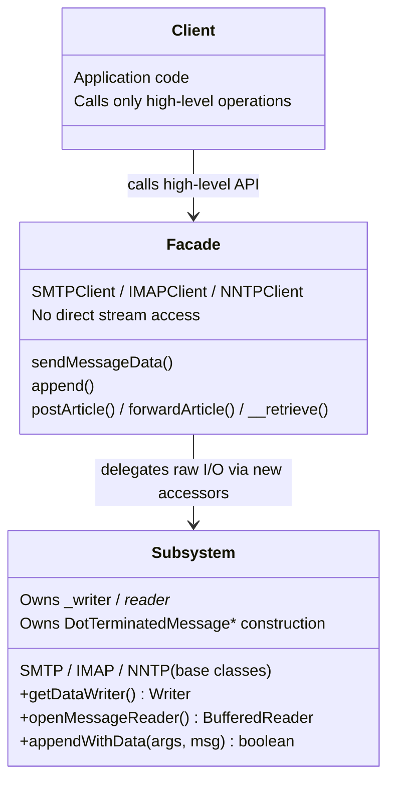

# Section 8c — Facade Pattern: Diagram of Implementation

This file contains the conceptual diagram for Section 8c (Facade — Two-Tier
Boundary Consistency) of the report, in the same three-conceptual-role style
used for the Builder diagram in Section 8a.

---

## Diagram of Implementation

---

## Caption (drop-in paragraph for the report)

This diagram shows the Facade Pattern at a high level using its three
conceptual roles applied to the SMTP, IMAP, and NNTP protocol stacks. The
**Client** (the calling application) interacts solely with the **Facade** —
`SMTPClient`, `IMAPClient`, or `NNTPClient` — invoking high-level operations
such as `sendMessageData()`, `append()`, `postArticle()`, `forwardArticle()`,
and `__retrieve()`. The Facade never touches raw protocol streams directly.
Instead, it delegates every piece of raw I/O to the **Subsystem** (the `SMTP`,
`IMAP`, and `NNTP` base classes) through three new accessors introduced by
this refactor: `getDataWriter()`, `openMessageReader()`, and
`appendWithData()`. The Subsystem is now the single owner of `_writer`,
`_reader_`, and every `DotTerminatedMessageWriter` /
`DotTerminatedMessageReader` instance — exactly mirroring the contract that
`FTPClient` and `FTP` have followed since the library's inception. The
diagram keeps the concept clean: one client surface, one facade, one
subsystem owning the wire format.
