# Process Flow Diagram — Apache Commons Net 3.5 (After Changes)

Paste the block below into any Mermaid renderer (e.g. mermaid.live).

```mermaid
flowchart TB
    classDef patternStyle fill:#ffe6cc,stroke:#d79b00,stroke-width:2px,color:#000
    classDef mainStyle fill:#dae8fc,stroke:#6c8ebf,color:#000
    classDef interfaceStyle fill:#d5e8d4,stroke:#82b366,color:#000
    classDef utilStyle fill:#fff2cc,stroke:#d6b656,color:#000
    classDef newStyle fill:#e1d5e7,stroke:#9673a6,stroke-width:2px,color:#000

    %% ── Main System Flow ──────────────────────────────────────────────

    APP([Your Application])

    subgraph SingletonLayer["Singleton Layer"]
        SFP["SocketFactoryProvider\nShared default socket factories"]
    end

    subgraph ClientLayer["Transport Layer"]
        SC["SocketClient (abstract)"]
        DSC["DatagramSocketClient (abstract)"]
    end

    subgraph ProtocolLayer["Protocol Layer"]
        FTP["FTP\ncommand layer"]
        FTPC["FTPClient\nhigh-level API"]
        FTPS["FTPSClient\nSSL variant"]
        SMTP_BASE["SMTP\ngetDataWriter() · fireReplyReceived() wired"]
        SMTPC["SMTPClient\nFacade — delegates raw I/O to base"]
        IMAP_BASE["IMAP\nappendWithData()"]
        IMAPC["IMAPClient\nFacade — delegates APPEND to base"]
        NNTP_BASE["NNTP\nopenMessageReader() · getDataWriter()"]
        NNTPC["NNTPClient\nFacade — delegates stream access to base"]
        NNTPS["NNTPSClient\nSSL variant — Template Method"]
        TELNETS["TelnetSClient\nSSL variant — Template Method"]
        OTHER["Telnet · POP3 · BSD r-commands"]
        UDP["UDP Clients\nNTP · Echo · Daytime..."]
    end

    subgraph ParserLayer["FTP Parser Layer"]
        FACTORY["DefaultFTPFileEntryParserFactory"]
        PIFACE["FTPFileEntryParser\ninterface"]
        COMPOSITE["CompositeFileEntryParser"]
        PARSERS["UnixFTPEntryParser\nNTFTPEntryParser\nVMSFTPEntryParser\nOS400FTPEntryParser\n..."]
    end

    subgraph ConfigLayer["FTP Config Layer"]
        FTPCONFIG["FTPClientConfig"]
        BUILDER["FTPClientConfig.Builder\nFluent construction — build()"]
    end

    subgraph EnumLayer["Command Enum Layer"]
        ENUMS["SMTPCommand · NNTPCommand · POP3Command\nType-safe protocol command enums"]
    end

    subgraph EventLayer["Event Layer"]
        CMDSUPPORT["ProtocolCommandSupport"]
        LISTENERS["ProtocolCommandListener\nPrintCommandListener"]
    end

    subgraph IOLayer["I/O Layer"]
        STREAMS["NetASCII Streams\nDotTerminatedMessageReader/Writer\nSocket Streams"]
        COPYADAPTER["CopyStreamAdapter"]
    end

    subgraph IterLayer["NNTP Iterators"]
        ITERATORS["ArticleIterator\nNewsgroupIterator\nReplyIterator"]
    end

    %% Main flow connections
    SFP --> SC & DSC
    APP --> SC & DSC
    SC --> FTP --> FTPC --> FTPS
    SC --> SMTP_BASE --> SMTPC
    SC --> IMAP_BASE --> IMAPC
    SC --> NNTP_BASE --> NNTPC --> NNTPS
    SC --> TELNETS
    SC --> OTHER
    DSC --> UDP

    FTPC --> FACTORY --> PIFACE --> COMPOSITE --> PARSERS
    FTPC --> FTPCONFIG
    BUILDER --> FTPCONFIG

    SMTP_BASE --> ENUMS
    NNTP_BASE --> ENUMS

    SC --> CMDSUPPORT --> LISTENERS
    FTPC --> STREAMS --> COPYADAPTER
    SMTPC --> STREAMS
    NNTPC --> STREAMS
    IMAPC --> STREAMS
    NNTPC --> ITERATORS

    %% ── Pattern Annotation Circles ────────────────────────────────────

    P_TEMPLATE(["🔵 Template"])
    P_FACADE(["🟢 Facade"])
    P_FACTORY(["🟠 Factory &\nAbstract Factory"])
    P_STRATEGY(["🔴 Strategy"])
    P_COMPOSITE(["🟣 Composite"])
    P_OBSERVER(["🟡 Observer\n(now complete for SMTP)"])
    P_DECORATOR(["🟤 Decorator"])
    P_ADAPTER(["⚪ Adapter"])
    P_ITERATOR(["🔶 Iterator"])
    P_SINGLETON(["🟦 Singleton"])
    P_BUILDER(["🟧 Builder"])
    P_ENUM(["🔷 Enum Command"])

    %% Template — connection skeleton; subclasses fill in _connectAction_
    P_TEMPLATE -..-> SC
    P_TEMPLATE -..-> FTP
    P_TEMPLATE -..-> FTPS
    P_TEMPLATE -..-> NNTPS
    P_TEMPLATE -..-> TELNETS

    %% Facade — high-level clients hide raw protocol complexity
    P_FACADE -..-> FTPC
    P_FACADE -..-> SMTPC
    P_FACADE -..-> IMAPC
    P_FACADE -..-> NNTPC

    %% Factory & Abstract Factory — creates the right parser for the server OS
    P_FACTORY -..-> FACTORY
    P_FACTORY -..-> PIFACE

    %% Strategy — each parser is a swappable algorithm
    P_STRATEGY -..-> PIFACE
    P_STRATEGY -..-> PARSERS

    %% Composite — CompositeFileEntryParser wraps many parsers as one
    P_COMPOSITE -..-> COMPOSITE
    P_COMPOSITE -..-> PARSERS

    %% Observer — command events fired to all registered listeners
    P_OBSERVER -..-> CMDSUPPORT
    P_OBSERVER -..-> LISTENERS
    P_OBSERVER -..-> SMTP_BASE

    %% Decorator — stream classes wrap existing streams to add behavior
    P_DECORATOR -..-> STREAMS

    %% Adapter — CopyStreamAdapter provides default no-ops for the listener interface
    P_ADAPTER -..-> COPYADAPTER

    %% Iterator — typed iterators over raw NNTP server responses
    P_ITERATOR -..-> ITERATORS

    %% Singleton — one shared SocketFactoryProvider for default factories
    P_SINGLETON -..-> SFP

    %% Builder — fluent construction of FTPClientConfig
    P_BUILDER -..-> BUILDER

    %% Enum Command — type-safe protocol command representation
    P_ENUM -..-> ENUMS

    class P_TEMPLATE,P_FACADE,P_FACTORY,P_STRATEGY,P_COMPOSITE,P_OBSERVER,P_DECORATOR,P_ADAPTER,P_ITERATOR patternStyle
    class P_SINGLETON,P_BUILDER,P_ENUM newStyle
```

---

## Reading This Diagram

- **Boxes with solid borders** are the system's components grouped by layer (top to bottom = the flow of a request through the library).
- **Orange dashed circles** are pattern annotations that existed before the changes. The dashed arrows show which components each pattern governs.
- **Purple dashed circles** are new pattern annotations introduced by the changes: Singleton, Builder, and Enum Command.
- **New and changed components are noted inline** — e.g., `SMTP` now shows that `fireReplyReceived()` is wired and `getDataWriter()` exists; `NNTPSClient` and `TelnetSClient` are new SSL variants in the Protocol Layer.
- **Overlaps** are visible where multiple pattern circles point to the same component:
  - `FTPFileEntryParser interface` ← Factory/Abstract Factory **and** Strategy
  - Concrete parsers ← Strategy **and** Composite
  - `CompositeFileEntryParser` ← Composite **and** Strategy
  - `SMTP base class` ← Facade **and** Observer (base holds raw I/O and fires Observer events)
  - `NNTPSClient`, `TelnetSClient` ← Template Method (override `_connectAction_` to inject SSL)
- **Singleton Layer** sits above Transport: `SocketFactoryProvider` feeds both `SocketClient` and `DatagramSocketClient` their default factory instances before any protocol work begins.

---

## Description

The process flow diagram shows how a request flows through Apache Commons Net 3.5 after all changes, and which design patterns govern each layer. New elements introduced by the changes appear at the top (Singleton Layer — `SocketFactoryProvider`), within the Protocol Layer (`NNTPSClient` and `TelnetSClient` as Template Method SSL variants; `SMTP`, `IMAP`, and `NNTP` base classes now carry Facade accessors and complete Observer wiring), in the new Config Layer (`FTPClientConfig.Builder`), and in the new Command Enum Layer (`SMTPCommand`, `NNTPCommand`, `POP3Command`). Three new pattern circles (Singleton, Builder, Enum Command) are added alongside the original set (Template, Facade, Factory, Strategy, Composite, Observer, Decorator, Adapter, Iterator), and the Facade circle now also points to `SMTPClient`, `IMAPClient`, and `NNTPClient` to reflect their reinforced boundaries.
